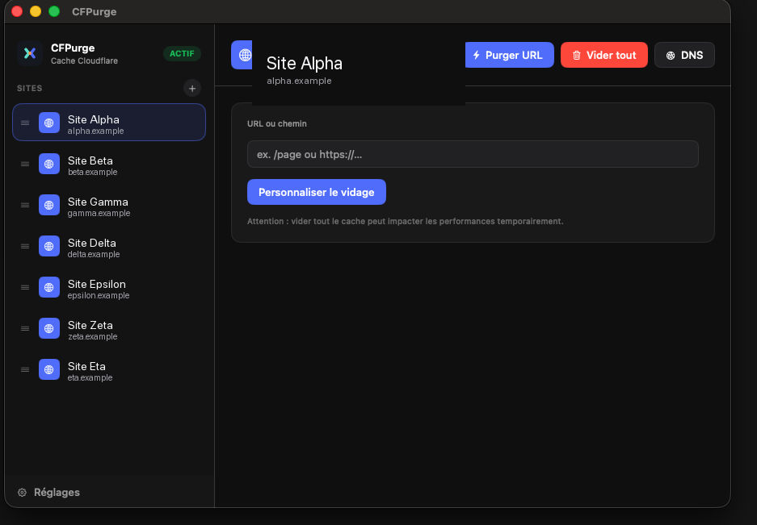
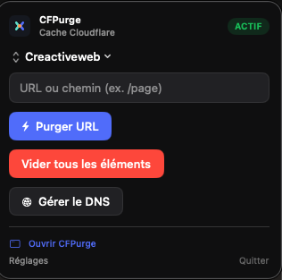

# CFPurge

Utilitaire macOS en barre de menus pour purger le cache Cloudflare — page par page ou zone entière — sans ouvrir le dashboard.

## Aperçu

**Fenêtre principale** — sites, purge du cache et DNS au même endroit :

**Popover barre de menus** — actions rapides sans quitter votre flux de travail :

## Fonctionnalités

- Popover compact dans la barre de menus + fenêtre principale complète
- Purge par URL ou chemin (`/ma-page/`)
- Purge totale d'une zone (avec confirmation)
- Multi-sites avec sidebar
- Gestion DNS intégrée (onglet Cache | DNS)
- Token API dans le Keychain macOS
- Réglages modernisés (token, Account ID, sites, mises à jour)
- Extension [Raycast](raycast-cfpurge/README.md) (délègue à l'app via `cfpurge://`)

## Installation

1. Téléchargez le `.dmg` sur la page [Releases](https://github.com/Crollin/CFPurge/releases)
2. Glissez **CFPurge** dans **Applications**
3. Lancez l'app — les réglages s'ouvrent au premier lancement

> Si macOS bloque l'app : clic droit → **Ouvrir**, ou autorisez dans **Réglages Système → Confidentialité et sécurité**.

Les mises à jour se vérifient automatiquement (Réglages → Général → Mises à jour).

## Configuration

1. Dans CFPurge → **Réglages → Jeton API**, ouvrez **Créer un jeton API sur Cloudflare** (ou le [dashboard](https://dash.cloudflare.com/profile/api-tokens)). Permissions : **Zone → Cache Purge → Edit** (et **Zone → DNS → Edit** si vous activez le DNS). Limitez le jeton à vos zones. N'utilisez **jamais** la Global API Key.
2. Collez le jeton → **Enregistrer** → **Tester la connexion**. L’**Account ID** est détecté automatiquement (copie rapide pour scripts / wrangler).
3. Ajoutez un site : **nom**, **Zone ID** (32 caractères hex dans Cloudflare → domaine → Aperçu), **domaine** (`monsite.com`)

## Utilisation

| Action | Comment |
|--------|---------|
| Purger une page | Popover ou fenêtre → URL ou chemin → **Purger URL** |
| Purger tout | **Vider tout** → confirmer |
| Gérer le DNS | Fenêtre principale → onglet **DNS** (ou **Gérer le DNS** depuis le popover) |
| Ouvrir la fenêtre complète | Popover → **Ouvrir CFPurge** |
| Sites / token / mises à jour | **Réglages** (engrenage) |

## Licence

MIT — [LICENSE](LICENSE) · [Creactive Web](https://github.com/Crollin)

Pour contribuer ou compiler depuis les sources : [CONTRIBUTING.md](CONTRIBUTING.md) · signaler une vulnérabilité : [SECURITY.md](SECURITY.md)

**Développeurs** : `./install.sh` installe l'app en local ; ajoutez `--raycast` pour déployer aussi l'extension Raycast (`scripts/install-raycast-extension.sh`). Détails dans [CONTRIBUTING.md](CONTRIBUTING.md).
